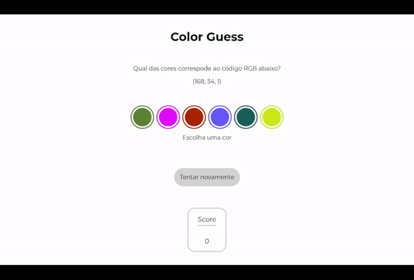

# Color Guess

Esse é um jogo em que o objetivo é acertar qual cor corresponde ao código RGB exibido, a partir de uma paleta de cores aleatórias.

O foco dessa aplicação foi explorar a manipulação de elementos DOM e os escutadores de eventos.

[Experimente!](https://lzaghi.github.io/color-guess/)

## Funcionalidades

- Geração de uma paleta inicial aleatória
- Possibilidade de resetar a paleta com novas cores aleatórias
- Escolher cor da paleta e receber feedback de acerto ou erro
- Placar que acumula pontos para acertos consecutivos
- Placar zerado e novas tentativas em caso de erro

## Demonstração




## Tecnologias utilizadas

HTML, CSS, JavaScript, DOM


## Instalação local

1. Clone o repositório 
```bash
  git clone git@github.com:lzaghi/color-guess.git
```

2. Entre no diretório 
```bash
  cd color-guess
```

3. Instale as dependências 
```bash
  npm install
```
4. Inicie a aplicação com a extensão Live Server do VSCode
    

